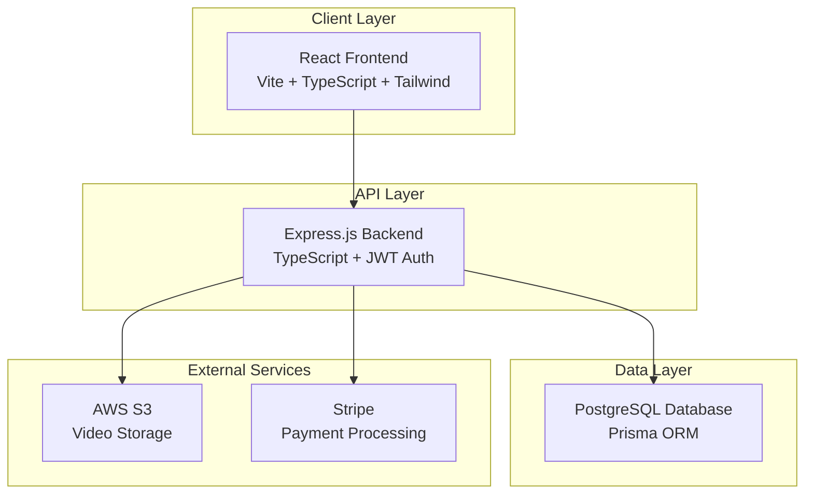
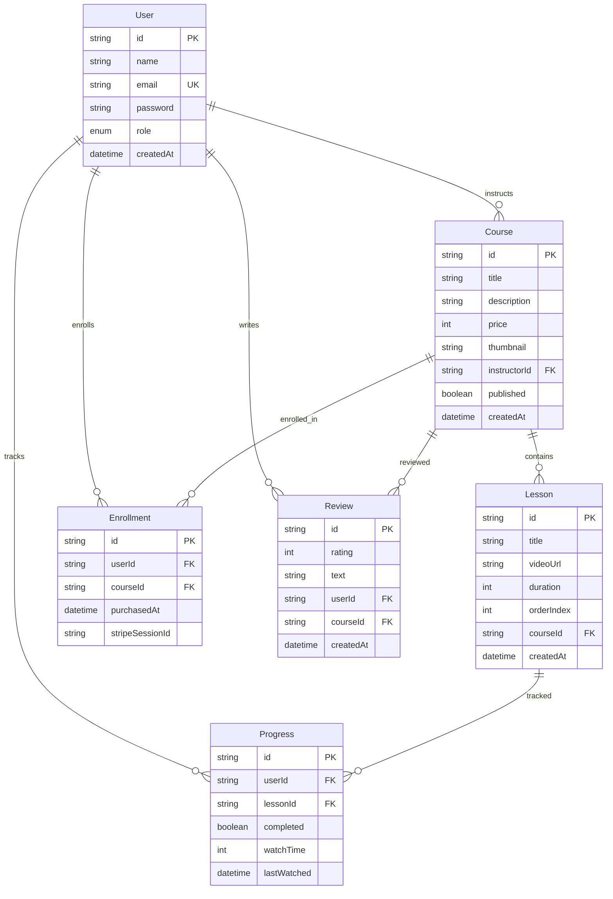

# Design Document

## Overview

VisionKiro AI IDE is a full-stack online learning platform built with modern web technologies. The system follows a monolithic architecture with clear separation between frontend (React) and backend (Node.js/Express) components. The platform supports role-based access control, secure payment processing, and scalable video content delivery.

## Architecture

### High-Level Architecture



### Technology Stack

- **Frontend**: React 18 + Vite + TypeScript + Tailwind CSS + React Query
- **Backend**: Node.js + Express + TypeScript + Prisma ORM
- **Database**: PostgreSQL with Prisma migrations
- **Authentication**: JWT with access/refresh token pattern
- **File Storage**: AWS S3 for videos and thumbnails
- **Payments**: Stripe Checkout with webhook verification
- **Deployment**: Vercel (frontend) + Render (backend) + Neon (database)

## Components and Interfaces

### Frontend Components

#### Core Layout Components
- `<Navbar />` - Navigation with role-based menu items
- `<Footer />` - Site-wide footer with links
- `<ProtectedRoute />` - Route wrapper for authentication checks
- `<DashboardLayout />` - Common layout for dashboard pages

#### Course Components
- `<CourseCard />` - Course preview with thumbnail, title, price
- `<CourseList />` - Grid/list view of courses with pagination
- `<CourseDetail />` - Full course information with purchase button
- `<LessonList />` - Structured lesson navigation within courses

#### Media Components
- `<VideoPlayer />` - Custom video player with progress tracking
- `<ThumbnailUpload />` - File upload component for course images
- `<VideoUpload />` - Chunked video upload with progress indication

#### User Interface Components
- `<LoginForm />` - Authentication form with validation
- `<RegisterForm />` - User registration with role selection
- `<ReviewSection />` - Course ratings and review display/submission
- `<ProgressTracker />` - Visual progress indicators for course completion

### Backend API Structure

#### Authentication Routes (`/api/auth`)
- `POST /register` - User registration with email validation
- `POST /login` - Authentication with JWT token generation
- `POST /refresh` - Token refresh using refresh token
- `POST /logout` - Token invalidation and cleanup

#### Course Management (`/api/courses`)
- `GET /` - Public course listing with search/filter
- `GET /:id` - Course details with enrollment status
- `POST /` - Course creation (instructor only)
- `PATCH /:id` - Course updates (owner/admin only)
- `DELETE /:id` - Course deletion (owner/admin only)

#### Lesson Management (`/api/lessons`)
- `POST /:courseId` - Add lesson to course
- `PATCH /:id` - Update lesson details
- `DELETE /:id` - Remove lesson from course
- `GET /:id/stream` - Secure video streaming endpoint

#### Payment Processing (`/api/payments`)
- `POST /checkout/session` - Create Stripe checkout session
- `POST /webhook/stripe` - Handle payment confirmations
- `GET /enrollments` - User's purchased courses

#### User Management (`/api/users`)
- `GET /profile` - Current user profile
- `PATCH /profile` - Update user information
- `GET /dashboard` - Role-specific dashboard data
- `GET /admin/users` - User management (admin only)

## Data Models

### Database Schema



### Key Data Relationships

- **User-Course**: Many-to-many through Enrollment (students) and one-to-many (instructors)
- **Course-Lesson**: One-to-many with ordered lessons
- **User-Progress**: Many-to-many through Progress tracking individual lesson completion
- **Course-Review**: One-to-many with rating aggregation

## Error Handling

### Frontend Error Handling

#### React Query Error Boundaries
- Global error boundary for unhandled React errors
- React Query error handling with retry logic
- Toast notifications for user-facing errors
- Form validation with real-time feedback

#### Error Types and Responses
- **Authentication Errors**: Redirect to login, clear tokens
- **Authorization Errors**: Display access denied message
- **Network Errors**: Retry mechanism with exponential backoff
- **Validation Errors**: Field-specific error messages

### Backend Error Handling

#### Centralized Error Middleware
```typescript
interface ApiError {
  status: number;
  message: string;
  code: string;
  details?: any;
}
```

#### Error Categories
- **400 Bad Request**: Input validation failures
- **401 Unauthorized**: Authentication required
- **403 Forbidden**: Insufficient permissions
- **404 Not Found**: Resource not found
- **409 Conflict**: Duplicate resource creation
- **500 Internal Server Error**: Unexpected server errors

#### Logging Strategy
- Structured logging with Winston
- Error tracking with request correlation IDs
- Sensitive data filtering in logs
- Performance monitoring integration

## Testing Strategy

### Frontend Testing

#### Unit Testing (Jest + React Testing Library)
- Component rendering and interaction tests
- Custom hook testing with React Hooks Testing Library
- API service function testing with mocked responses
- Form validation and submission testing

#### Integration Testing
- User flow testing with React Testing Library
- API integration testing with MSW (Mock Service Worker)
- Authentication flow testing
- Payment flow testing with Stripe test mode

### Backend Testing

#### Unit Testing (Jest + Supertest)
- Controller function testing with mocked services
- Service layer business logic testing
- Utility function testing (JWT, validation, etc.)
- Database query testing with test database

#### Integration Testing
- Full API endpoint testing with test database
- Authentication middleware testing
- File upload testing with mocked S3
- Stripe webhook testing with test events

### End-to-End Testing (Playwright)
- Complete user registration and login flows
- Course purchase and enrollment process
- Video playback and progress tracking
- Instructor course creation workflow
- Admin user management scenarios

## Security Considerations

### Authentication & Authorization
- JWT tokens with short expiration (15 minutes access, 7 days refresh)
- Secure HTTP-only cookies for refresh tokens
- Role-based access control (RBAC) middleware
- Password hashing with bcrypt (12 rounds)

### Input Validation & Sanitization
- Zod schema validation for all API inputs
- SQL injection prevention through Prisma ORM
- XSS prevention with input sanitization
- File upload validation (type, size, content)

### API Security
- Rate limiting with express-rate-limit
- CORS configuration for allowed origins
- Helmet.js for security headers
- Request size limits and timeout handling

### Data Protection
- Environment variable management for secrets
- Database connection encryption
- S3 bucket access controls and signed URLs
- Stripe webhook signature verification

## Performance Optimization

### Frontend Performance
- Code splitting with React.lazy and Suspense
- Image optimization with lazy loading
- React Query caching for API responses
- Bundle size optimization with Vite

### Backend Performance
- Database query optimization with Prisma
- Connection pooling for database connections
- Caching strategy for frequently accessed data
- Efficient file upload handling with streaming

### Video Delivery
- AWS S3 CloudFront CDN integration
- Adaptive bitrate streaming for different devices
- Video compression and format optimization
- Progressive video loading

## Deployment Architecture

### Production Environment
- **Frontend**: Vercel with automatic deployments from Git
- **Backend**: Render with Docker containerization
- **Database**: Neon PostgreSQL with automated backups
- **CDN**: CloudFront for static assets and video content

### CI/CD Pipeline
- GitHub Actions for automated testing and deployment
- Environment-specific configuration management
- Database migration automation
- Health check monitoring and alerting

### Monitoring & Observability
- Application performance monitoring
- Error tracking and alerting
- Database performance monitoring
- User analytics and usage tracking